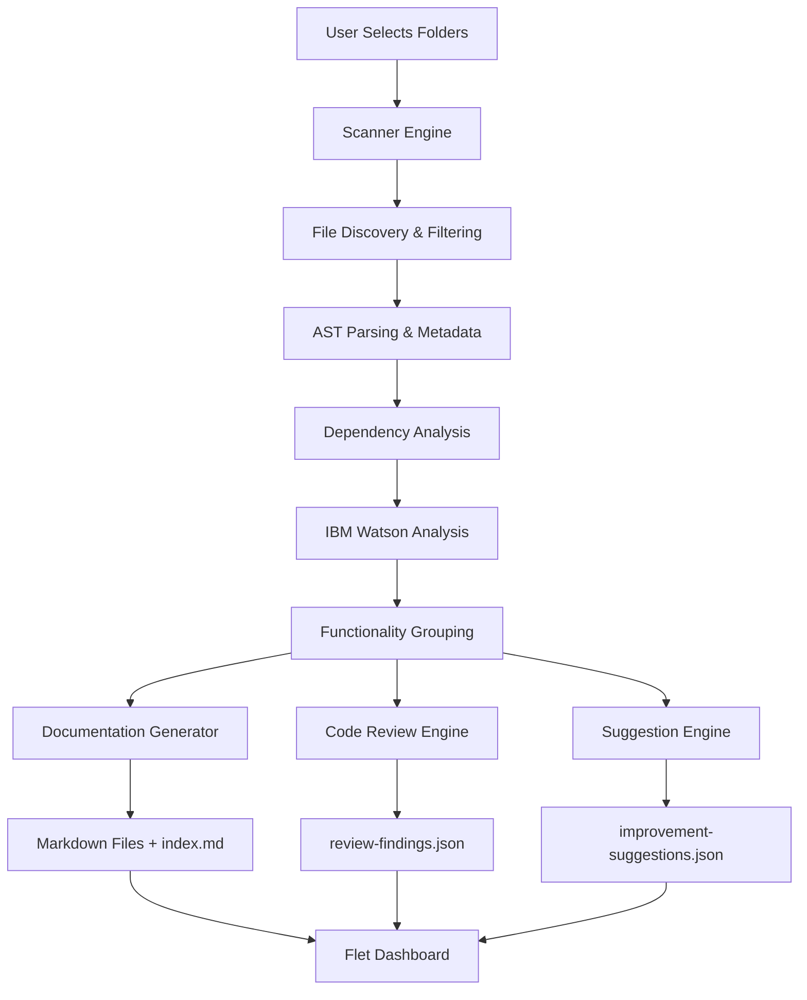

# Codebase Analysis & Documentation Generator - Technical Plan

## Executive Summary

A Python desktop application that analyzes project codebases, generates structured Markdown documentation optimized for AI context, performs intelligent code reviews, and presents findings through a modern Flet-based dashboard.

**Key Technologies:**
- **UI Framework:** Flet (Flutter-based, modern animations, Material Design)
- **AI Analysis:** IBM Watson AI (watsonx.ai) for intelligent code understanding
- **Static Analysis:** AST parsing, pylint, radon, bandit
- **File Processing:** pathlib, gitignore-parser, tree-sitter
- **Documentation:** markdown-it-py, jinja2
- **Data Storage:** JSON files, SQLite for session management

---

## 1. Architecture Overview

### High-Level Architecture

```
┌─────────────────────────────────────────────────────────────┐
│                     Flet UI Layer                           │
│  (Dashboard, File Selection, Progress, Results Display)     │
└────────────────┬────────────────────────────────────────────┘
                 │
┌────────────────┴────────────────────────────────────────────┐
│                  Application Core                           │
│  ┌──────────────┐  ┌──────────────┐  ┌──────────────┐     │
│  │   Scanner    │  │   Analyzer   │  │  Generator   │     │
│  │   Engine     │→ │   Engine     │→ │   Engine     │     │
│  └──────────────┘  └──────────────┘  └──────────────┘     │
└─────────────────────────────────────────────────────────────┘
                 │
┌────────────────┴────────────────────────────────────────────┐
│                  Service Layer                              │
│  ┌──────────────┐  ┌──────────────┐  ┌──────────────┐     │
│  │ File System  │  │ IBM Watson   │  │   Static     │     │
│  │   Service    │  │   Service    │  │  Analysis    │     │
│  └──────────────┘  └──────────────┘  └──────────────┘     │
└─────────────────────────────────────────────────────────────┘
                 │
┌────────────────┴────────────────────────────────────────────┐
│                  Data Layer                                 │
│  ┌──────────────┐  ┌──────────────┐  ┌──────────────┐     │
│  │   JSON       │  │   SQLite     │  │  Markdown    │     │
│  │   Storage    │  │   Cache      │  │   Files      │     │
│  └──────────────┘  └──────────────┘  └──────────────┘     │
└─────────────────────────────────────────────────────────────┘
```

### Data Flow



---

## 2. Folder Structure

```
codebase-analyzer/
├── src/
│   ├── main.py                      # Application entry point
│   ├── app.py                       # Flet app initialization
│   │
│   ├── core/                        # Core business logic
│   │   ├── __init__.py
│   │   ├── scanner.py               # File scanning engine
│   │   ├── analyzer.py              # Code analysis orchestrator
│   │   ├── grouper.py               # Functionality grouping
│   │   ├── reviewer.py              # Code review engine
│   │   ├── suggester.py             # Improvement suggestions
│   │   └── generator.py             # Documentation generator
│   │
│   ├── services/                    # External services
│   │   ├── __init__.py
│   │   ├── filesystem.py            # File operations
│   │   ├── watson_ai.py             # IBM Watson integration
│   │   ├── static_analysis.py       # AST, linting, security
│   │   ├── language_detector.py     # Language/framework detection
│   │   └── cache_manager.py         # Caching layer
│   │
│   ├── models/                      # Data models
│   │   ├── __init__.py
│   │   ├── project.py               # Project model
│   │   ├── file_info.py             # File metadata
│   │   ├── functionality.py         # Functionality group
│   │   ├── finding.py               # Code review finding
│   │   ├── suggestion.py            # Improvement suggestion
│   │   └── schemas.py               # JSON schemas
│   │
│   ├── ui/                          # Flet UI components
│   │   ├── __init__.py
│   │   ├── app_layout.py            # Main app layout
│   │   ├── pages/
│   │   │   ├── __init__.py
│   │   │   ├── home.py              # Project selection
│   │   │   ├── scan_progress.py     # Scanning progress
│   │   │   ├── overview.py          # Results overview
│   │   │   ├── documentation.py     # Documentation viewer
│   │   │   ├── findings.py          # Code review findings
│   │   │   ├── suggestions.py       # Improvement suggestions
│   │   │   └── settings.py          # Configuration
│   │   ├── components/
│   │   │   ├── __init__.py
│   │   │   ├── file_picker.py       # Custom file picker
│   │   │   ├── progress_card.py     # Progress indicators
│   │   │   ├── finding_card.py      # Finding display card
│   │   │   ├── suggestion_card.py   # Suggestion display card
│   │   │   ├── filter_panel.py      # Filtering controls
│   │   │   ├── chart_widgets.py     # Charts and graphs
│   │   │   └── markdown_viewer.py   # Markdown renderer
│   │   └── theme.py                 # UI theme configuration
│   │
│   ├── utils/                       # Utility functions
│   │   ├── __init__.py
│   │   ├── file_utils.py            # File operations
│   │   ├── text_utils.py            # Text processing
│   │   ├── markdown_utils.py        # Markdown generation
│   │   ├── json_utils.py            # JSON operations
│   │   ├── logger.py                # Logging configuration
│   │   └── config.py                # Configuration management
│   │
│   └── templates/                   # Documentation templates
│       ├── functionality.md.j2      # Functionality doc template
│       ├── index.md.j2              # Index template
│       └── review_summary.md.j2     # Review summary template
│
├── tests/                           # Test suite
│   ├── __init__.py
│   ├── test_scanner.py
│   ├── test_analyzer.py
│   ├── test_grouper.py
│   ├── test_reviewer.py
│   └── fixtures/                    # Test fixtures
│
├── config/                          # Configuration files
│   ├── default_ignore.txt           # Default ignore patterns
│   ├── language_patterns.json       # Language detection rules
│   └── review_rules.json            # Code review rules
│
├── docs/                            # Project documentation
│   └── user_guide.md
│
├── requirements.txt                 # Python dependencies
├── setup.py                         # Package setup
├── README.md                        # Project README
└── .env.example                     # Environment variables template
```

---

## 3. Core Components Design

### 3.1 Scanner Engine

**Purpose:** Discover and filter files in selected project folders.

**Key Features:**
- Recursive directory traversal
- Gitignore-style pattern matching
- Language/framework detection
- File metadata extraction
- Dependency graph building
- Safe handling of large/binary files
- Progress tracking for UI updates

**Default Ignore Patterns:**
```
node_modules/, .git/, .venv/, venv/, __pycache__/, *.pyc
dist/, build/, .next/, .nuxt/, *.min.js, *.min.css
package-lock.json, yarn.lock, *.log, *.tmp, *.cache
.DS_Store, *.exe, *.dll, *.so, *.dylib
```

**Output:** `ScanResult` containing:
- List of discovered files with metadata
- Ignored files count
- Language distribution
- Dependency graph
- Error/warning messages

---

### 3.2 Analyzer Engine

**Purpose:** Orchestrate code analysis using static analysis + IBM Watson AI.

**Analysis Pipeline:**
1. **Static Analysis** (Fast, deterministic)
   - AST parsing using tree-sitter
   - Complexity metrics (cyclomatic, cognitive)
   - Code quality checks (pylint, flake8)
   - Security scanning (bandit)
   - Type checking (mypy for Python)

2. **AI Analysis** (Intelligent, semantic)
   - Send code chunks to IBM Watson
   - Semantic understanding of functionality
   - Pattern recognition
   - Business logic extraction
   - Cross-file relationship detection

3. **Combined Insights**
   - Merge static + AI results
   - Resolve conflicts
   - Prioritize findings
   - Build comprehensive understanding

**Optimization Strategies:**
- Batch API requests to IBM Watson
- Cache AI responses for identical code
- Parallel processing of independent files
- Progressive analysis with early results

---

### 3.3 Functionality Grouper

**Purpose:** Group related files into logical functionality areas.

**Grouping Strategy:**

1. **Structural Hints**
   - Folder names (auth/, payments/, api/)
   - File naming conventions
   - Module organization

2. **Code Analysis**
   - Import relationships
   - Shared dependencies
   - Function call graphs
   - Data flow patterns

3. **Semantic Understanding** (IBM Watson)
   - Purpose similarity
   - Business domain clustering
   - Functionality overlap detection

4. **Framework Conventions**
   - MVC patterns (models, views, controllers)
   - API routes grouping
   - Component hierarchies
   - Service layers

**Output:** List of `FunctionalityGroup` objects:
```python
FunctionalityGroup(
    id="authentication",
    name="Authentication",
    description="User login, JWT handling, session management",
    files=["src/auth/login.py", "src/auth/jwt.py", ...],
    entry_points=["login()", "verify_token()"],
    dependencies=["database", "email-service"],
    complexity_score=7.5
)
```

---

### 3.4 Documentation Generator

**Purpose:** Create structured Markdown documentation optimized for AI context.

**Generation Strategy:**

1. **Per-Functionality Documentation**
   - One Markdown file per functionality group
   - Keep files under 500 lines
   - Split large groups into sub-documents

2. **Content Structure** (using Jinja2 templates)
   ```markdown
   # [Functionality Name]
   
   ## Purpose
   [High-level description]
   
   ## Related Files
   - `path/to/file.py` - [Brief description]
   
   ## Key Components
   ### Classes
   - `ClassName` - [Purpose]
   
   ### Functions
   - `function_name()` - [Purpose]
   
   ## Data Flow
   [Explanation of how data moves through this functionality]
   
   ## Business Rules
   [Important logic and constraints]
   
   ## Dependencies
   - Internal: [Other functionality areas]
   - External: [APIs, services, libraries]
   
   ## Configuration
   - `ENV_VAR_NAME` - [Description]
   
   ## Known Issues & Risks
   [From code review findings]
   
   ## Notes for AI Assistants
   [Context hints for future AI usage]
   ```

3. **Index Generation**
   - Create `index.md` as navigation map
   - Include reading order suggestions
   - Cross-reference related docs
   - Provide search keywords

**Size Management:**
- Target: 300-500 lines per file
- Split threshold: 600 lines
- Minimum: 50 lines (merge small groups)

---

### 3.5 Code Review Engine

**Purpose:** Detect bugs, risks, and code quality issues.

**Review Categories:**

1. **Bugs & Logic Errors**
   - Incorrect conditionals
   - Type mismatches
   - Null/None access risks
   - Unreachable code
   - Incorrect async/await usage

2. **User Oversights**
   - Unused variables/imports
   - Dead code
   - Repeated calculations
   - Duplicate logic
   - Ignored return values

3. **Type & Data Problems**
   - String/number comparison issues
   - Missing validation
   - Unsafe dictionary access
   - Date/time parsing errors
   - Precision issues

4. **Performance Issues**
   - N+1 query patterns
   - Repeated expensive operations
   - Missing caching opportunities
   - Inefficient algorithms

5. **Security & Reliability**
   - Hardcoded secrets
   - Missing input validation
   - SQL injection risks
   - Missing authentication checks
   - Weak error handling

**Detection Methods:**

1. **Static Analysis Rules**
   - Pylint/Flake8 rules
   - Bandit security checks
   - Custom AST pattern matching
   - Regex-based detection

2. **AI-Powered Detection** (IBM Watson)
   - Semantic bug detection
   - Context-aware analysis
   - Cross-file issue detection
   - Business logic validation

**Output Format:** `review-findings.json`
```json
{
  "projectName": "example-project",
  "reviewedAt": "2026-05-16T12:00:00Z",
  "summary": {
    "totalFindings": 24,
    "critical": 1,
    "high": 4,
    "medium": 10,
    "low": 7,
    "info": 2
  },
  "functionalityAreas": [
    {
      "id": "authentication",
      "name": "Authentication",
      "relatedFiles": ["src/auth/login.py"],
      "findings": [
        {
          "id": "AUTH-001",
          "title": "JWT secret read without validation",
          "severity": "high",
          "confidence": "high",
          "category": "security",
          "type": "missing_validation",
          "file": "src/auth/jwt.py",
          "functionName": "create_token",
          "lineStart": 18,
          "lineEnd": 24,
          "problem": "JWT secret read from env without existence check",
          "whyItMatters": "May fail at runtime or use unsafe fallback",
          "evidence": "JWT_SECRET = os.getenv('JWT_SECRET')",
          "suggestedFix": "Validate JWT_SECRET exists during startup",
          "tags": ["security", "environment", "runtime-risk"],
          "status": "open"
        }
      ]
    }
  ]
}
```

**Confidence Levels:**
- **High:** Definite issue with clear evidence
- **Medium:** Likely issue but context-dependent
- **Low:** Possible issue requiring human review

---

### 3.6 Improvement Suggestion Engine

**Purpose:** Generate actionable improvement recommendations.

**Suggestion Categories:**

1. **Performance Optimizations**
   - Add caching for repeated operations
   - Optimize database queries
   - Batch API calls
   - Add pagination

2. **Code Quality**
   - Extract duplicate logic
   - Split large functions
   - Improve naming
   - Add type hints

3. **Reliability**
   - Add error handling
   - Add retry logic
   - Add validation
   - Add logging

4. **Maintainability**
   - Move hardcoded values to config
   - Add documentation
   - Improve folder structure
   - Add tests

5. **Security**
   - Add authentication checks
   - Add rate limiting
   - Improve input validation
   - Add security headers

**Suggestion Generation Process:**

1. **Analyze Review Findings**
   - Group related issues
   - Identify patterns
   - Detect root causes

2. **Detect Opportunities**
   - Repeated code patterns
   - Missing best practices
   - Framework-specific improvements

3. **Prioritize Suggestions**
   - Impact assessment
   - Effort estimation
   - Risk evaluation
   - Dependency ordering

**Output Format:** `improvement-suggestions.json`
```json
{
  "projectName": "example-project",
  "generatedAt": "2026-05-16T12:00:00Z",
  "summary": {
    "totalSuggestions": 12,
    "highPriority": 3,
    "mediumPriority": 6,
    "lowPriority": 3
  },
  "suggestions": [
    {
      "id": "IMPROVE-001",
      "title": "Cache repeated product price calculations",
      "category": "performance",
      "priority": "high",
      "effort": "medium",
      "expectedImpact": "Reduces computation, improves response time",
      "functionalityArea": "Product Pricing",
      "relatedFiles": ["src/pricing/calculate_price.py"],
      "relatedFindings": ["PRICING-003"],
      "problemObserved": "Same pricing calculation executed multiple times per request",
      "recommendation": "Calculate once and reuse throughout request lifecycle",
      "implementationApproach": [
        "Extract pricing calculation into dedicated service",
        "Store result in request context",
        "Add Redis cache for cross-request reuse",
        "Add cache invalidation on product updates"
      ],
      "risks": ["Incorrect cache invalidation could show outdated prices"],
      "status": "suggested"
    }
  ]
}
```

---

## 4. IBM Watson AI Integration

### 4.1 Watson Service Design

**API Integration:**
- Use IBM watsonx.ai REST API
- Authentication via API key
- Model selection: granite-code or codellama

**Request Optimization:**
- Batch multiple code chunks in single request
- Use streaming for large responses
- Implement request queuing
- Add retry logic with exponential backoff

**Caching Strategy:**
- Cache AI responses by code hash
- Store in SQLite database
- TTL: 7 days for code analysis
- Invalidate on code changes

### 4.2 AI Analysis Prompts

**Functionality Understanding:**
```
Analyze this code and identify:
1. Primary purpose and functionality
2. Key business logic
3. Data flow and transformations
4. External dependencies
5. Potential grouping with related code
```

**Bug Detection:**
```
Review this code for potential issues:
1. Logic errors and bugs
2. Type mismatches
3. Null/undefined access risks
4. Incorrect error handling
5. Security vulnerabilities
Provide specific line references and evidence.
```

**Improvement Suggestions:**
```
Suggest improvements for this code:
1. Performance optimizations
2. Code quality enhancements
3. Maintainability improvements
4. Security hardening
Prioritize by impact and effort.
```

### 4.3 Fallback Strategy

If IBM Watson API is unavailable:
1. Use static analysis only
2. Show warning in UI
3. Generate documentation without AI insights
4. Allow retry later
5. Cache partial results

---

## 5. Flet UI Design

### 5.1 Application Layout

**Main Navigation:**
```
┌─────────────────────────────────────────────────────────┐
│  [Logo] Codebase Analyzer        [Settings] [Theme]    │
├─────────────────────────────────────────────────────────┤
│  [Home] [Scan] [Docs] [Findings] [Suggestions]         │
├─────────────────────────────────────────────────────────┤
│                                                         │
│                   Page Content                          │
│                                                         │
└─────────────────────────────────────────────────────────┘
```

### 5.2 Page Designs

**Home Page:**
- Welcome message
- Recent projects list
- "New Analysis" button
- Quick stats from last analysis

**Scan Progress Page:**
- Folder selection dialog
- Ignore pattern configuration
- Real-time progress bars:
  - Files scanned
  - Files analyzed
  - Documentation generated
  - Review completed
- Live log output
- Cancel button

**Overview Page:**
- Project summary cards:
  - Total files scanned
  - Languages detected
  - Functionality groups found
  - Findings by severity
  - Suggestions by priority
- Charts:
  - Language distribution (pie chart)
  - Findings by category (bar chart)
  - Complexity heatmap
- Quick actions:
  - View documentation
  - Export results
  - Re-analyze

**Documentation Page:**
- File tree navigation
- Markdown viewer with syntax highlighting
- Search functionality
- Quick links to related findings
- Export to PDF option

**Findings Page:**
- Filter panel:
  - Severity
  - Category
  - Functionality area
  - File
  - Status
- Findings list with cards:
  - Severity badge
  - Title and description
  - File and line reference
  - Evidence code snippet
  - Suggested fix
  - Mark as resolved button
- Sort options:
  - By severity
  - By file
  - By category

**Suggestions Page:**
- Filter panel:
  - Priority
  - Effort
  - Category
  - Status
- Suggestion cards:
  - Priority badge
  - Title and impact
  - Implementation steps
  - Related findings
  - Accept/Dismiss buttons
- Roadmap view:
  - Timeline visualization
  - Dependency graph

### 5.3 UI Components

**Custom Components:**

1. **FilePickerDialog**
   - Multi-folder selection
   - Folder tree view
   - Ignore pattern editor
   - Preview selected files

2. **ProgressCard**
   - Animated progress bar
   - Status text
   - Estimated time remaining
   - Cancel button

3. **FindingCard**
   - Expandable/collapsible
   - Severity color coding
   - Code snippet with syntax highlighting
   - Action buttons

4. **SuggestionCard**
   - Priority indicator
   - Effort estimation
   - Implementation checklist
   - Related findings links

5. **FilterPanel**
   - Multi-select dropdowns
   - Search input
   - Clear filters button
   - Active filter chips

6. **ChartWidget**
   - Pie charts (language distribution)
   - Bar charts (findings by category)
   - Line charts (complexity trends)
   - Interactive tooltips

7. **MarkdownViewer**
   - Syntax highlighting
   - Table of contents
   - Copy code button
   - Link navigation

### 5.4 Animations

**Page Transitions:**
- Fade in/out (300ms)
- Slide animations for navigation

**Loading States:**
- Skeleton screens
- Shimmer effects
- Spinner for long operations

**Interactive Feedback:**
- Button press animations
- Card hover effects
- Expand/collapse animations
- Success/error toast notifications

**Progress Indicators:**
- Animated progress bars
- Pulsing status indicators
- Smooth percentage updates

---

## 6. Data Models

### 6.1 Core Models

**Project:**
```python
@dataclass
class Project:
    id: str
    name: str
    root_paths: List[Path]
    created_at: datetime
    last_analyzed: datetime
    config: ProjectConfig
```

**FileInfo:**
```python
@dataclass
class FileInfo:
    path: Path
    relative_path: str
    language: str
    size_bytes: int
    line_count: int
    encoding: str
    hash: str
    imports: List[str]
    exports: List[str]
    complexity: float
```

**FunctionalityGroup:**
```python
@dataclass
class FunctionalityGroup:
    id: str
    name: str
    description: str
    files: List[FileInfo]
    entry_points: List[str]
    dependencies: List[str]
    complexity_score: float
    risk_level: str
```

**Finding:**
```python
@dataclass
class Finding:
    id: str
    title: str
    severity: Literal["critical", "high", "medium", "low", "info"]
    confidence: Literal["high", "medium", "low"]
    category: str
    type: str
    file: str
    function_name: Optional[str]
    class_name: Optional[str]
    line_start: int
    line_end: int
    problem: str
    why_it_matters: str
    evidence: str
    suggested_fix: str
    tags: List[str]
    status: Literal["open", "resolved", "dismissed"]
```

**Suggestion:**
```python
@dataclass
class Suggestion:
    id: str
    title: str
    category: str
    priority: Literal["high", "medium", "low"]
    effort: Literal["high", "medium", "low"]
    expected_impact: str
    functionality_area: str
    related_files: List[str]
    related_findings: List[str]
    problem_observed: str
    recommendation: str
    implementation_approach: List[str]
    risks: List[str]
    status: Literal["suggested", "accepted", "dismissed", "completed"]
```

### 6.2 JSON Schemas

**review-findings.json Schema:**
```json
{
  "$schema": "http://json-schema.org/draft-07/schema#",
  "type": "object",
  "required": ["projectName", "reviewedAt", "summary", "functionalityAreas"],
  "properties": {
    "projectName": {"type": "string"},
    "reviewedAt": {"type": "string", "format": "date-time"},
    "summary": {
      "type": "object",
      "properties": {
        "totalFindings": {"type": "integer"},
        "critical": {"type": "integer"},
        "high": {"type": "integer"},
        "medium": {"type": "integer"},
        "low": {"type": "integer"},
        "info": {"type": "integer"}
      }
    },
    "functionalityAreas": {
      "type": "array",
      "items": {"$ref": "#/definitions/functionalityArea"}
    }
  }
}
```

---

## 7. Library Dependencies

### 7.1 Core Libraries

**File Processing:**
- `pathlib` - Path operations (built-in)
- `pathspec` - Gitignore pattern matching
- `chardet` - Encoding detection
- `watchdog` - File system monitoring (optional)

**Code Analysis:**
- `tree-sitter` - Multi-language AST parsing
- `ast` - Python AST (built-in)
- `pylint` - Python linting
- `radon` - Complexity metrics
- `bandit` - Security analysis
- `mypy` - Type checking

**AI Integration:**
- `requests` - HTTP client for IBM Watson API
- `aiohttp` - Async HTTP client
- `tenacity` - Retry logic

**Documentation:**
- `jinja2` - Template engine
- `markdown-it-py` - Markdown parsing
- `pygments` - Syntax highlighting

**Data Storage:**
- `pydantic` - Data validation
- `jsonschema` - JSON schema validation
- `sqlite3` - Local database (built-in)

**UI Framework:**
- `flet` - Flutter-based UI framework
- `plotly` - Interactive charts
- `markdown` - Markdown rendering in UI

**Utilities:**
- `python-dotenv` - Environment variables
- `loguru` - Logging
- `tqdm` - Progress bars (CLI fallback)
- `click` - CLI interface (optional)

### 7.2 requirements.txt

```
# Core
flet>=0.21.0
pydantic>=2.0.0
python-dotenv>=1.0.0
loguru>=0.7.0

# File Processing
pathspec>=0.11.0
chardet>=5.0.0

# Code Analysis
tree-sitter>=0.20.0
pylint>=3.0.0
radon>=6.0.0
bandit>=1.7.0
mypy>=1.8.0

# AI Integration
requests>=2.31.0
aiohttp>=3.9.0
tenacity>=8.2.0

# Documentation
jinja2>=3.1.0
markdown-it-py>=3.0.0
pygments>=2.17.0

# Data
jsonschema>=4.20.0

# Charts
plotly>=5.18.0

# Testing
pytest>=7.4.0
pytest-asyncio>=0.21.0
pytest-cov>=4.1.0
```

---

## 8. Implementation Phases

### Phase 1: Foundation (Week 1-2)

**Goals:**
- Set up project structure
- Implement basic file scanner
- Create data models
- Set up Flet UI skeleton

**Deliverables:**
- Working file scanner with ignore patterns
- Basic UI with folder selection
- Data models and schemas defined
- Project configuration system

### Phase 2: Analysis Engine (Week 3-4)

**Goals:**
- Implement static analysis
- Integrate IBM Watson AI
- Build functionality grouper
- Create caching system

**Deliverables:**
- AST parsing for Python/JavaScript
- IBM Watson API integration
- Functionality grouping algorithm
- SQLite cache implementation

### Phase 3: Documentation Generator (Week 5)

**Goals:**
- Create Markdown templates
- Implement documentation generator
- Generate index.md
- Add cross-references

**Deliverables:**
- Jinja2 templates
- Documentation generator
- Index file generation
- File size management

### Phase 4: Code Review Engine (Week 6-7)

**Goals:**
- Implement static analysis rules
- Add AI-powered bug detection
- Create finding classification
- Generate review-findings.json

**Deliverables:**
- Static analysis integration
- AI review prompts
- Finding data structure
- JSON output generation

### Phase 5: Suggestion Engine (Week 8)

**Goals:**
- Analyze review findings
- Generate improvement suggestions
- Prioritize suggestions
- Create improvement-suggestions.json

**Deliverables:**
- Suggestion generation logic
- Priority/effort estimation
- Implementation approach generation
- JSON output

### Phase 6: Dashboard UI (Week 9-10)

**Goals:**
- Build all UI pages
- Implement filters and search
- Add charts and visualizations
- Polish animations

**Deliverables:**
- Complete Flet dashboard
- All pages functional
- Charts and graphs
- Smooth animations

### Phase 7: Testing & Polish (Week 11-12)

**Goals:**
- Write unit tests
- Integration testing
- Performance optimization
- Documentation

**Deliverables:**
- Test coverage >80%
- Performance benchmarks
- User guide
- README and setup docs

---

## 9. MVP Scope

### MVP Features (Minimum Viable Product)

**Core Functionality:**
1. ✅ Folder selection (single or multiple)
2. ✅ File scanning with basic ignore patterns
3. ✅ Language detection (Python, JavaScript, TypeScript)
4. ✅ Simple functionality grouping (folder-based + imports)
5. ✅ Basic Markdown documentation generation
6. ✅ index.md generation
7. ✅ Static analysis only (no AI initially)
8. ✅ Basic code review (pylint + bandit)
9. ✅ Simple improvement suggestions
10. ✅ Basic Flet UI with:
    - Folder selection
    - Progress display
    - Results overview
    - Findings list
    - Suggestions list

**Excluded from MVP:**
- ❌ Advanced AI analysis (add in v1.1)
- ❌ Multi-language support beyond Python/JS
- ❌ Complex charts and visualizations
- ❌ Export to PDF
- ❌ Project history tracking
- ❌ Advanced caching
- ❌ Real-time file watching

### MVP Timeline: 6 Weeks

**Week 1-2:** Scanner + Basic UI
**Week 3:** Static Analysis + Grouping
**Week 4:** Documentation Generator
**Week 5:** Review Engine + Suggestions
**Week 6:** UI Polish + Testing

---

## 10. Future Enhancements (Post-MVP)

### Version 1.1
- IBM Watson AI integration
- Advanced functionality grouping
- Multi-language support (Java, Go, Ruby, PHP)
- Enhanced visualizations
- Export to PDF
- Repo onboarding explanation (for new devs to get familiar with the repo fast)

### Version 1.2
- Project history and comparison
- Real-time file watching
- Collaborative features
- Custom review rules
- Plugin system

### Version 2.0
- Team dashboard
- CI/CD integration
- GitHub/GitLab integration
- Automated PR reviews
- Code quality trends

---

## 11. Configuration

### Environment Variables (.env)

```bash
# IBM Watson AI
IBM_WATSON_API_KEY=your_api_key_here
IBM_WATSON_URL=https://us-south.ml.cloud.ibm.com
IBM_WATSON_PROJECT_ID=your_project_id

# Application
APP_ENV=development
LOG_LEVEL=INFO
CACHE_DIR=.cache
OUTPUT_DIR=docs/code-context

# Analysis Settings
MAX_FILE_SIZE_MB=10
MAX_WORKERS=4
ENABLE_AI_ANALYSIS=true
AI_BATCH_SIZE=5
```

### User Configuration (config.yaml)

```yaml
ignore_patterns:
  - node_modules/
  - .git/
  - __pycache__/
  - "*.pyc"
  - dist/
  - build/

languages:
  - python
  - javascript
  - typescript

analysis:
  max_file_size_mb: 10
  enable_ai: true
  ai_batch_size: 5
  
documentation:
  max_lines_per_file: 500
  split_threshold: 600
  
review:
  severity_threshold: low
  confidence_threshold: medium
```

---

## 12. Success Metrics

### Technical Metrics
- Scan speed: <5 seconds per 100 files
- Analysis accuracy: >90% for bug detection
- Documentation quality: AI-readable, <500 lines per file
- UI responsiveness: <100ms for interactions
- Memory usage: <500MB for typical projects

### User Experience Metrics
- Setup time: <5 minutes
- Time to first results: <2 minutes for small projects
- False positive rate: <10%
- User satisfaction: >4/5 stars

---

## 13. Risk Mitigation

### Technical Risks

**Risk:** IBM Watson API rate limits or downtime
**Mitigation:** 
- Implement caching
- Add fallback to static analysis
- Queue requests with retry logic

**Risk:** Large codebases causing memory issues
**Mitigation:**
- Stream file processing
- Implement chunking
- Add memory limits
- Process files in batches

**Risk:** Inaccurate functionality grouping
**Mitigation:**
- Combine multiple signals (structure + imports + AI)
- Allow manual regrouping in UI
- Learn from user corrections

**Risk:** Too many false positives in code review
**Mitigation:**
- Use confidence levels
- Allow user feedback
- Tune detection rules
- Provide evidence for each finding

### User Experience Risks

**Risk:** Complex UI overwhelming users
**Mitigation:**
- Progressive disclosure
- Guided onboarding
- Sensible defaults
- Clear documentation

**Risk:** Slow analysis for large projects
**Mitigation:**
- Show progress clearly
- Allow cancellation
- Provide time estimates
- Enable incremental analysis

---

## 14. Next Steps

1. **Review and approve this plan**
2. **Set up development environment**
3. **Create project structure**
4. **Begin Phase 1 implementation**
5. **Iterate based on feedback**

---

## Questions for Clarification

1. Do you have an IBM Watson API key ready, or should we plan for static-analysis-only MVP first? ans: key ready
2. What operating systems should we prioritize? (Windows, macOS, Linux) ans: first MacOS, then Linux, then Windows
3. Do you want CLI support in addition to GUI?
4. Should the app support analyzing remote repositories (GitHub URLs)? ans: not in the MVP, maybe in future versions
5. Any specific programming languages to prioritize beyond Python/JavaScript? ans: will be determined later when MVP is done
6. Do you want the app to integrate with version control (git) for tracking changes over time? ans: eventually yes

---

**End of Plan**